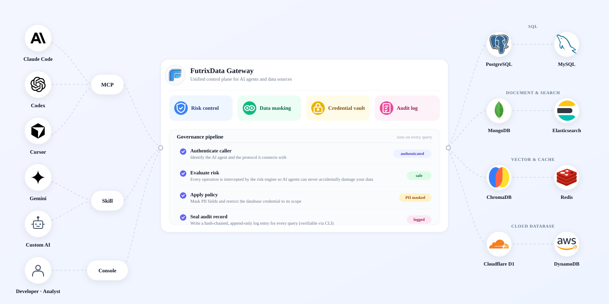

# FutrixData

<p align="center">
  
</p>

<p align="center">
  <strong>An open-source AI data gateway for governed agent access to real databases.</strong>
</p>

<p align="center">
  <a href="LICENSE"></a>
  <a href="go.mod"></a>
  <a href="frontend/package.json"></a>
  <a href="wails.json"></a>
</p>

FutrixData sits between AI agents and production data systems. Agents get a consistent tool surface for querying and analyzing data, while teams keep credentials, risk checks, masking, approvals, and audit trails under one local control plane.

The goal is simple: let agents work with useful data without handing them raw database credentials or unlimited execution power.

## Why FutrixData

AI agents are moving from text assistants into operational workflows. Direct database access creates several hard problems:

- **Credential sprawl:** every agent, IDE, script, and workflow can end up holding its own database password or cloud token.
- **Unsafe execution:** generated SQL, Redis commands, or datasource requests may delete data, run expensive scans, or bypass review.
- **Sensitive output:** agent responses can leak emails, phone numbers, tokens, addresses, payment fields, or internal identifiers.
- **Weak accountability:** without a gateway, it is hard to answer who asked for a query, which tool executed it, and what policy decision was made.

FutrixData centralizes that boundary. The database stays behind a governed local runtime; agents interact through FutrixData's CLI, MCP-compatible tool layer, HTTP service, or desktop UI.

## Core Features

| Area | What FutrixData provides |
| --- | --- |
| Data gateway | One runtime for desktop UI, CLI, HTTP, daemon handoff, and agent tool execution. |
| Datasource adapters | MySQL, PostgreSQL, MongoDB, Redis, Elasticsearch, DynamoDB, ChromaDB, and Cloudflare D1 surfaces. |
| Risk controls | Statement analysis, dangerous-operation detection, approval-aware tool execution, and rule-driven decisions. |
| Sensitivity controls | Schema-aware classification, masking policies, deterministic local masking, and no raw data in classification prompts. |
| Agent identity | Access-key based attribution for agent calls, local authorization flows, revocation, and audit-friendly request envelopes. |
| AI workspace | Built-in chat, tool calling, streaming responses, knowledge retrieval, visualization output, and configurable datasource-aware prompting. |
| Local-first operations | Runtime files, datasource state, logs, key material, and agent audit state are kept in the user's local data directory by default. |

## Supported Data Sources

| Datasource | Connect | Query / command | Schema discovery | Risk checks |
| --- | --- | --- | --- | --- |
| MySQL | Yes | SQL | Yes | Yes |
| PostgreSQL | Yes | SQL | Yes | Yes |
| MongoDB | Yes | Mongo shell-like operations | Yes | Yes |
| Redis | Yes | Redis commands | Key and command context | Yes |
| Elasticsearch | Yes | DSL / index operations | Yes | Yes |
| DynamoDB | Yes | Table operations | Yes | Yes |
| ChromaDB | Yes | Collection requests | Yes | Yes |
| Cloudflare D1 | Yes | SQL / REST-backed operations | Yes | Yes |

## How It Works

```text
AI agent / CLI / UI
        |
        v
FutrixData runtime
  - agent identity and authorization
  - datasource secret resolution
  - statement parsing and risk checks
  - sensitivity classification and masking
  - execution audit trail
        |
        v
Databases, caches, indexes, warehouses, and vector stores
```

The same runtime backs the Wails desktop app, the `futrixdata-cli` command, the local daemon, and the optional HTTP server. This keeps policy behavior consistent across human and agent entry points.

## Quick Start

### Requirements

- Go 1.23 or newer. The repository currently pins the Go toolchain to `go1.24.3`.
- Node.js 20 or newer.
- Wails v2.11 for desktop development.

Install Wails if it is not already available:

```bash
go install github.com/wailsapp/wails/v2/cmd/wails@v2.11.0
```

Install frontend dependencies:

```bash
cd frontend
npm install
cd ..
```

Run the desktop app in development mode:

```bash
wails dev
```

Build the frontend and run backend tests:

```bash
npm --prefix frontend run build
go test $(go list ./... | grep -v '/frontend/node_modules/')
node --test packaging/cli/tests/*.test.mjs
```

Build the desktop app:

```bash
wails build
```

Run the optional HTTP service:

```bash
go run ./cmd/http
```

Build and run the CLI during development:

```bash
go run ./cmd/futrixdata-cli --help
```

## Repository Layout

```text
frontend/                 Vue 3 desktop UI, Vite build, Vitest tests
internal/                 Core runtime, datasource adapters, risk, masking, IPC, daemon, MCP, auth
cmd/futrixdata-cli/       CLI entry point for agent and operator workflows
cmd/http/                 Optional HTTP server entry point
packaging/                CLI and npm packaging helpers
scripts/                  Release and install helper scripts
build/                    Wails application icons and static build metadata
docs/assets/              README media assets
```

The repository intentionally excludes the root `data/` directory and other local runtime files such as datasource records, logs, auth sessions, schema caches, generated chat history, local prompts, agent-specific skills, internal task notes, and temporary build outputs.

## Development Notes

FutrixData is a local-first desktop project. During development, the app may create ignored files under `data/`, `frontend/dist/`, `frontend/wailsjs/`, and `build/bin/`. These are runtime or generated artifacts and must not be committed.

Common checks:

```bash
go test $(go list ./... | grep -v '/frontend/node_modules/')
node --test packaging/cli/tests/*.test.mjs
npm --prefix frontend run build
```

For UI changes, run the relevant Vitest files with `npm --prefix frontend run test -- <test-file>` and validate the Wails desktop runtime, not only the Vite browser preview. The desktop shell, IPC daemon, packaged assets, and frontend bindings are part of the product surface.

## Contributing

Issues and pull requests are welcome. Useful contributions include datasource adapter fixes, risk-rule coverage, masking behavior improvements, desktop workflow polish, tests, packaging fixes, and documentation that helps operators run FutrixData safely.

Before contributing, read [CONTRIBUTING.md](CONTRIBUTING.md) and keep secrets, credentials, private logs, customer data, and local runtime files out of public issues and pull requests.

## Security

FutrixData is a security-sensitive project. Please do not disclose exploitable details, credentials, customer data, or private logs in public issues. Follow [SECURITY.md](SECURITY.md) for responsible reporting.

## License

FutrixData is licensed under the Apache License 2.0. See [LICENSE](LICENSE).
