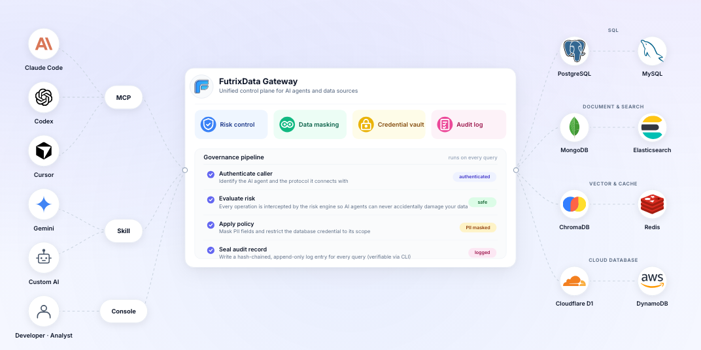

<p align="center">
  
</p>

<h1 align="center">FutrixData Security Package</h1>

<p align="center">
  Public security specifications, verifiers, protocol types, masking code, and a partial risk-engine core for FutrixData.
</p>

<p align="center">
  <a href="LICENSE"></a>
  <a href="go.mod"></a>
  <a href="https://futrixdata.com/doc"></a>
  <a href="docs/assurance-matrix.md"></a>
</p>

FutrixData is an AI data gateway for teams that want agents to work with real databases without handing raw credentials or unrestricted execution power to the agent. This repository is the **inspectable public security package**: the pieces a security reviewer, procurement team, or integrator can read, run, and compare against FutrixData product behavior during evaluation.

> **Scope:** this repository is Apache-2.0. The FutrixData desktop application and FutrixData Enterprise Edition remain commercial, proprietary products under their own license terms.

## Product References

Start with the official product docs when evaluating what this package supports:

- [FutrixData product site](https://futrixdata.com/)
- [Technical overview](https://futrixdata.com/doc/futrixdata-technical-overview)
- [Database risk control engine](https://futrixdata.com/doc/database-risk-control-engine)
- [Data sensitivity classification](https://futrixdata.com/doc/data-sensitivity-classification)
- [FutrixData Enterprise Edition](https://futrixdata.com/doc/futrixdata-enterprise-edition)

## Quick Start

Run the public verification suite:

```bash
go test ./...
```

Verify the sanitized product-export evidence bundle:

```bash
go run ./cmd/futrix-evidence-verify ./examples/product-export
```

Verify an audit log hash chain:

```bash
go run ./cmd/futrix-audit-verify ./examples/audit-log/valid.jsonl
```

Verify downloaded release artifacts when a `SHA256SUMS.txt` file is present:

```bash
bash ./release-verification/verify-checksums.sh /path/to/downloads
```

## What You Can Inspect

| Area | Public path | What it proves |
| --- | --- | --- |
| Audit chain | `pkg/auditchain`, `cmd/futrix-audit-verify` | Local hash-chain audit format and verifier behavior. |
| PII masking | `pkg/masking` | L1-L5 sensitivity model and deterministic `masked:v1:` HMAC output. |
| Partial risk engine | `pkg/riskengine` | Rule model, lightweight parser, matching priority, and allow/warn/approval/block decisions. |
| Agent protocol | `pkg/protocol` | Tool names, response envelopes, approval payloads, errors, audit IDs, and risk attribution. |
| Evidence verifier | `pkg/evidence`, `cmd/futrix-evidence-verify` | End-to-end checks for audit, masking, block, and approval examples. |
| Release verification | `release-verification/verify-checksums.sh` | Checksum validation for published release assets. |

## Buyer Evaluation Workflow

Use this repository as the public part of an Enterprise security review:

1. Read the [assurance matrix](docs/assurance-matrix.md) to map product claims to code and verification steps.
2. Run `go test ./...` to confirm the public packages compile and pass.
3. Run `go run ./cmd/futrix-evidence-verify ./examples/product-export` to validate the evidence bundle.
4. During POC, ask FutrixData for equivalent exports from a disposable datasource:
   - an agent query with masked columns;
   - a destructive statement that is blocked;
   - a statement held for approval with `riskAttribution`;
   - an exported agent audit log that can be checked with `futrix-audit-verify`.

## How FutrixData Uses These Concepts

Agents call FutrixData over MCP, Skill, CLI, or HTTP instead of holding database credentials directly. FutrixData attributes each call to an agent identity, evaluates risk before execution, applies approval gates when needed, masks sensitive fields before agent egress, and records activity in an audit log with a local hash chain.

This repository exposes the reviewable contracts behind that flow. The commercial products provide the full runtime: datasource adapters, richer parser integrations, EXPLAIN probes, trust-mode storage, approval routing, daemon behavior, UI, Enterprise deployment, SSO/RBAC, and operational controls.

## Repository Layout

```text
cmd/futrix-audit-verify/     Standalone audit-log verifier
cmd/futrix-evidence-verify/  Evidence-bundle verifier CLI
pkg/auditchain/              Local audit hash-chain verifier
pkg/masking/                 Deterministic field masking
pkg/riskengine/              Portable risk-engine core
pkg/protocol/                Public agent tool protocol types
pkg/evidence/                Evidence-bundle verifier package
docs/                        Specs, assurance matrix, and scope notes
examples/                    Audit, risk-rule, and product-export fixtures
release-verification/        Checksum verification helper
```

## What Is Not Open

This repository does not include the complete FutrixData product. The following remain proprietary:

- desktop UI, datasource adapters, and credential storage;
- account, license, billing, and entitlement flows;
- Enterprise deployment, RBAC, SSO, and tenant administration;
- signing, notarization, release credentials, and private build systems.

The boundary is intentional: the public package supports review and verification of key security claims without making the full commercial product reconstructable from this repository alone.

## Known Limits

- **Local audit hash chains are not remote notarization.** They detect changes to the current file, but a fully privileged local attacker can rewrite the file and recompute hashes unless an external anchor is used.
- **Deterministic masking is not anonymization.** It preserves equality for agent analysis, but low-cardinality values remain guessable by enumeration.
- **The public risk engine is a portable subset.** The commercial product adds live datasource execution, EXPLAIN probes, trust modes, approval routing, and Enterprise policy controls.

## Specifications

- [Open-source scope analysis](docs/open-source-scope.md)
- [Assurance matrix](docs/assurance-matrix.md)
- [Production consistency statement](docs/production-consistency.md)
- [Evidence bundle](docs/evidence-bundle.md)
- [Threat model](docs/threat-model.md)
- [Audit-chain specification](docs/audit-chain.md)
- [Masking specification](docs/masking.md)
- [Partial risk-engine specification](docs/risk-engine.md)
- [Agent protocol](docs/agent-protocol.md)

## Contributing and Security

- Contribution guidelines: [CONTRIBUTING.md](CONTRIBUTING.md)
- Security policy: [SECURITY.md](SECURITY.md)
- Attribution notice: [NOTICE](NOTICE)

## License

This repository is licensed under Apache-2.0. See [LICENSE](LICENSE).

The FutrixData desktop application and FutrixData Enterprise Edition remain commercial products under their own license terms.
